# Piano di Implementazione: Lista Spesa Intelligente - FridgeWise

## 📋 Panoramica Progetto

**Obiettivo**: Creare un sistema intelligente di generazione liste spesa che ottimizza automaticamente gli acquisti basandosi su ricette selezionate, ingredienti disponibili, budget e preferenze utente.

---

## 🎯 Analisi Funzionale

### Funzionalità Core
- **Generazione automatica** da ricette selezionate
- **Controllo inventario** in tempo reale
- **Ottimizzazione intelligente** con AI
- **Stima budget** accurata
- **Collaborazione familiare** in tempo reale
- **Integrazione e-commerce** per confronto prezzi

---

## 🏗️ Architettura Sistema


---

## 📦 Componenti Principali

### Backend - Nuovi Moduli
- `backend/services/shoppingListService.ts` - Servizio principale gestione liste
- `backend/utils/recipeAnalyzer.ts` - Analisi ingredienti ricette
- `backend/utils/inventoryChecker.ts` - Controllo disponibilità
- `backend/utils/smartOptimizer.ts` - Ottimizzazione intelligente

### Database Schema
```javascript
// ShoppingList Schema
{
  _id: ObjectId,
  userId: ObjectId,
  name: String,
  items: [{
    ingredientId: ObjectId,
    name: String,
    quantity: Number,
    unit: String,
    category: String,
    estimatedPrice: Number,
    priority: String,
    isPurchased: Boolean,
    recipeSource: ObjectId
  }],
  totalEstimatedCost: Number,
  createdAt: Date,
  updatedAt: Date,
  status: String // active, completed, archived
}
```

### Frontend Components
**Mobile:**
- `frontend/mobile/src/components/ShoppingListScreen.tsx`
- `frontend/mobile/src/components/SmartListGenerator.tsx`
- `frontend/mobile/src/components/ShoppingListItem.tsx`

**Web:**
- `frontend/web/src/pages/ShoppingListPage.tsx`
- `frontend/web/src/components/ListGeneratorModal.tsx`

---

## 🔄 Flusso di Generazione Intelligente

```mermaid
sequenceDiagram
    User->>App: Seleziona ricette
    App->>Backend: Invia lista ricette
    Backend->>RecipeAnalyzer: Analizza ingredienti
    RecipeAnalyzer->>InventoryChecker: Verifica disponibilità
    InventoryChecker->>FridgeAPI: Controlla stock
    FridgeAPI-->>InventoryChecker: Ingredienti mancanti
    InventoryChecker->>SmartOptimizer: Applica ottimizzazioni
    SmartOptimizer->>GeminiAI: Richiede suggerimenti
    GeminiAI-->>SmartOptimizer: Suggerimenti intelligenti
    SmartOptimizer-->>Backend: Lista ottimizzata
    Backend-->>App: Mostra lista spesa
```



---

## ✨ Features Avanzate

### 1. Ottimizzazione Intelligente
- **Raggruppamento categorie**: frutta, verdura, latticini, ecc.
- **Sostituzioni ingredienti**: suggerimenti alternativi
- **Calcolo budget ottimale**: stima accurata costi
- **Prioritizzazione**: basata su scadenze ingredienti

### 2. Integrazione E-commerce
- Confronto prezzi supermercati
- Liste pre-compilate per catene
- Coupon e offerte personalizzate

### 3. Collaborazione Familiare
- Liste condivise in tempo reale
- Notifiche aggiornamenti
- Assegnazione compiti acquisto

---

## 📅 Implementazione Graduale

### Fase 1: MVP (2-3 settimane)
- [ ] Backend: API CRUD liste spesa
- [ ] Mobile: Schermata lista base
- [ ] Web: Interfaccia web semplice
- [ ] Generazione da ricetta singola

### Fase 2: Ottimizzazione (2 settimane)
- [ ] Analisi multi-ricetta
- [ ] Controllo inventario automatico
- [ ] Raggruppamento per categorie
- [ ] Calcolo stima costi

### Fase 3: AI Enhancement (3 settimane)
- [ ] Integrazione Gemini per suggerimenti
- [ ] Ottimizzazione budget
- [ ] Sostituzioni intelligenti
- [ ] Apprendimento preferenze utente

### Fase 4: Social & Collaboration (2-3 settimane)
- [ ] Liste condivise
- [ ] Notifiche push
- [ ] Integrazione supermercati
- [ ] Gamification

---

## ⚙️ Considerazioni Tecniche

### Performance
- **Cache Redis** per liste frequenti
- **Lazy loading** ingredienti
- **Paginazione** liste lunghe

### Sicurezza
- Validazione input lato server
- Rate limiting API
- Autorizzazione liste utente

### Scalabilità
- Microservizi per analisi ricette
- Queue system per generazione liste
- Database sharding per utenti

---

## 🔌 API Endpoints

```typescript
// Shopping List API
POST   /api/shopping-lists              // Crea nuova lista
GET    /api/shopping-lists              // Lista utente
GET    /api/shopping-lists/:id          // Dettaglio lista
PUT    /api/shopping-lists/:id          // Aggiorna lista
DELETE /api/shopping-lists/:id          // Elimina lista

// Smart Generation
POST   /api/shopping-lists/generate     // Genera da ricette
POST   /api/shopping-lists/optimize     // Ottimizza esistente
GET    /api/shopping-lists/suggestions  // Suggerimenti AI
```

---

## 🧪 Testing Strategy

- **Unit Tests**: Logica di ottimizzazione
- **Integration Tests**: Flusso completo generazione
- **E2E Tests**: User journey mobile/web
- **Performance Tests**: Tempo generazione liste grandi

---

## 📊 KPI di Successo

| Metrica | Target | Strumento |
|---------|--------|-----------|
| Tempo generazione lista | < 2 secondi | Performance monitoring |
| Accuratezza stima costi | 90% | User feedback |
| Engagement utenti | +40% | Analytics |
| Riduzione sprechi | -25% | Inventory tracking |

---

## 🎯 Prossimi Passi

1. **Setup ambiente sviluppo** per nuovi servizi
2. **Design database** con indici ottimizzati
3. **Creazione API base** con validazione
4. **Implementazione mobile** schermata principale
5. **Testing end-to-end** con utenti beta

---

## 💡 Suggerimenti Implementazione

### Quick Wins
- Iniziare con generazione da singola ricetta
- Usare componenti UI esistenti dove possibile
- Implementare cache semplice con Redis
- Testare con piccolo gruppo utenti

### Rischi da Monitorare
- Performance con liste molto lunghe
- Accuratezza stima prezzi
- Sincronizzazione multi-device
- Gestione conflitti liste condivise

---

**Documento creato**: 14 Luglio 2025  
**Versione**: 1.0  
**Stato**: Pronto per implementazione Fase 1